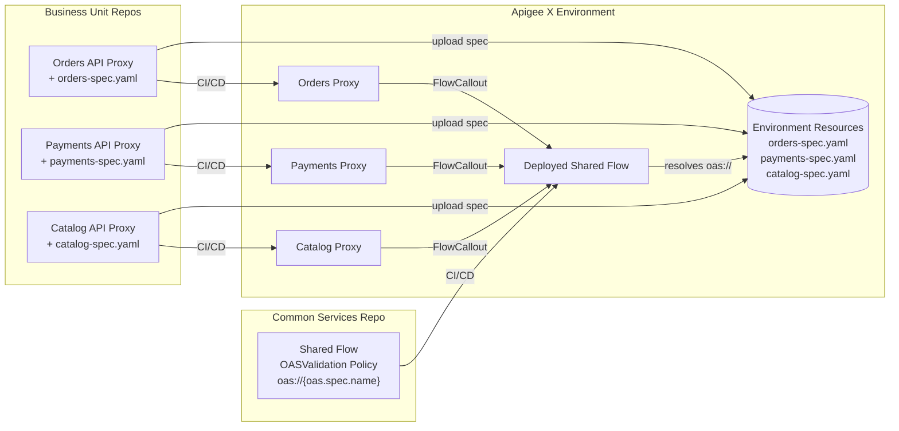
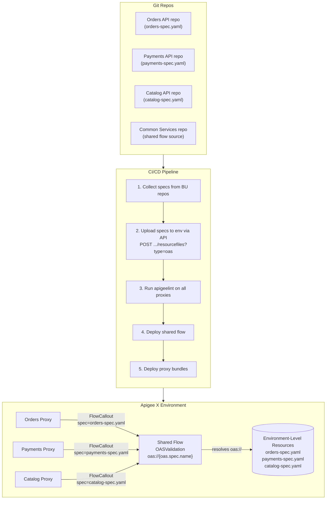

# Scaling OpenAPI Spec Validation via Shared Flows

## Overview



## The Problem

In an enterprise Apigee X deployment, a **Common Services team** owns the
shared flows that enforce organization-wide API governance: authentication, rate
limiting, threat protection, logging, and request/response validation. These
shared flows are deployed across environments and attached to every API proxy
via flow hooks or FlowCallout policies.

Meanwhile, individual **Business Unit teams** (Orders, Payments, Catalog, etc.)
each publish their own API proxies with their own OpenAPI specifications. Each
proxy needs request validation against its own spec, but the Common Services
team wants a single, centrally managed validation flow rather than trusting
every team to wire up OASValidation correctly.

**The goal:** A shared flow owned by Common Services that runs the
OASValidation policy, where each calling proxy dictates which OpenAPI spec to
validate against -- **without bundling every business unit's spec into the
shared flow.** The shared flow should not need to be redeployed every time a
business unit adds or updates an API spec.

### Enterprise Context

- No one deploys directly to Apigee. All deployments go through a custom CI/CD
  pipeline fed by multiple Git repos (one per business unit, plus a shared-flows
  repo owned by Common Services).
- Shared flows are versioned and deployed independently of API proxies.
- Business units own their OpenAPI specs alongside their proxy source code.

### What Apigee X Provides

### OASValidation Policy

The [OASValidation policy](https://cloud.google.com/apigee/docs/api-platform/reference/policies/oas-validation-policy)
validates requests and/or responses against an OpenAPI 3.0 specification.

**Spec storage** -- the docs state:

> "The OpenAPI Specification is stored as a resource in the following standard
> location within the API proxy bundle: `apiproxy/resources/oas`. The OpenAPI
> Specification must have a `.json`, `.yml`, `.yaml` extension."
>
> -- [OASValidation policy reference](https://cloud.google.com/apigee/docs/api-platform/reference/policies/oas-validation-policy)

**Scope note** -- the OASValidation policy page includes this statement:

> "You can store the OpenAPI Specification with the API proxy revision only."
>
> -- [OASValidation policy reference](https://cloud.google.com/apigee/docs/api-platform/reference/policies/oas-validation-policy)

However, this appears to contradict the general resource files documentation
(see [Resource Scoping](#resource-scoping-in-apigee-x) below), which lists
`oas` as a first-class resource type with no per-type scoping restriction. The
OASValidation policy page may simply be outdated or narrowly describing the
default/common case.

**Message template support** -- the `<OASResource>` element supports runtime
variable substitution:

> "You can specify the OpenAPI Specification using a message template, such as
> `{oas.resource.url}`. In this case, the value of flow variable
> `oas.resource.url` (in curly braces) will be evaluated and substituted into
> the payload string at runtime."
>
> -- [OASValidation policy reference](https://cloud.google.com/apigee/docs/api-platform/reference/policies/oas-validation-policy)

This means `<OASResource>oas://{variable.name}</OASResource>` is a documented,
supported pattern.

### Resource Scoping in Apigee X

Apigee supports storing resource files at multiple scopes. The
[resource files documentation](https://cloud.google.com/apigee/docs/api-platform/develop/resource-files)
describes three levels:

> "Resources can be stored in one of the following three locations:
> **API proxy revision**: Resources are available only to the API proxy
> revisions... **Environment**: When stored in an environment (for example,
> `test` or `prod`), resources are available to any API proxy deployed in the
> same environment. **Organization**: When stored in an organization, resources
> are available to any API proxy deployed in any environment."
>
> -- [Managing resource files](https://cloud.google.com/apigee/docs/api-platform/develop/resource-files)

**Note:** In Apigee X/hybrid, organization-level resources are explicitly
not supported:

> "You can't store resource files in an organization."
>
> -- [Managing resource files](https://cloud.google.com/apigee/docs/api-platform/develop/resource-files)

Only proxy-revision and environment scopes are available in Apigee X.

The resolution order is documented as:

> "Resolve resource names from the most specific to the most general scope.
> Resource names are resolved 'up the chain', from the API proxy revision
> level, to the environment level."
>
> -- [Managing resource files](https://cloud.google.com/apigee/docs/api-platform/develop/resource-files)

**Crucially, `oas` IS listed as a first-class resource type** in the general
resource files documentation. The resource types table includes:

> "**OpenAPI Specification (oas)** -- OpenAPI Specification used to validate
> request and response messages of type JSON or YAML."
>
> -- [Managing resource files](https://cloud.google.com/apigee/docs/api-platform/develop/resource-files)

The full list of resource types on that page is: `graphql`, `java`, `js`,
`jsc`, **`oas`**, `properties`, `py`, `securityPolicy`, `wsdl`, `xsd`, `xsl`.

The "Where resources are stored" section describes two scopes (proxy revision
and environment) with **no per-type restrictions**. It does not say "only
certain types can be stored at environment level." This strongly suggests that
`oas` resources can be stored at environment scope, despite the OASValidation
policy page's narrower "API proxy revision only" statement.

Environment-level resources are uploaded via the management API:

```bash
# Upload an OAS spec at environment scope
curl -X POST \
  "https://apigee.googleapis.com/v1/organizations/$ORG/environments/$ENV/resourcefiles?name=orders-api.yaml&type=oas" \
  -H "Authorization: Bearer $TOKEN" \
  -H "Content-Type: application/octet-stream" \
  -d @orders-api.yaml
```

**This needs empirical testing** -- see [Open Questions](#open-questions).

### The Challenge

Combining these facts creates a tension with a potential resolution:

1. **Contradictory scoping documentation.** The OASValidation policy page says
   ["You can store the OpenAPI Specification with the API proxy revision only"](https://cloud.google.com/apigee/docs/api-platform/reference/policies/oas-validation-policy),
   but the general resource files page lists [`oas` as a standard resource type](https://cloud.google.com/apigee/docs/api-platform/develop/resource-files)
   alongside types that clearly support environment-level storage, with no
   per-type scoping restrictions. This suggests environment-level OAS storage
   may work but needs testing.

2. **Shared flows are deployed independently.** The shared flow bundle has its
   own `sharedflowbundle/resources/oas/` directory, but a shared flow cannot
   reference resources from a *calling* proxy's bundle -- at least not per any
   documentation.

3. **No cross-scope URI syntax exists.** There is no way to write
   `oas://env://spec.yaml` or `oas://proxy://spec.yaml`. The `oas://` scheme
   takes a plain filename and relies on the implicit resolution chain.

4. **Property set precedent is ambiguous.** Property sets in shared flows are
   known to resolve from the calling proxy's context rather than the shared
   flow's own bundle: ["a policy in the shared flow can only read a property
   set in the actual proxy"](https://discuss.google.dev/t/access-a-property-set-in-a-shared-flow/6719).
   This was acknowledged by Apigee engineer dchiesa1 as ["both 'by design' and
   'a bug', a design bug"](https://discuss.google.dev/t/access-a-property-set-in-a-shared-flow/6719).
   Whether `oas://` resources exhibit the same runtime behavior is unknown --
   no one has publicly confirmed or denied it.

5. **The docs are silent on shared flow resource resolution.** The resource
   scoping documentation describes resolution for "API proxy revisions" but
   never mentions how resources resolve when a policy runs inside a shared flow
   invoked via FlowCallout.

### Approaches

### Option A: Bundle All Specs in the Shared Flow (Message Template)

The shared flow contains every business unit's spec and selects at runtime
using the documented message template feature:

```xml
<!-- In the shared flow -->
<OASValidation name="OAS-Validate">
  <OASResource>oas://{oas.spec.name}</OASResource>
  <Source>request</Source>
</OASValidation>
```

Each proxy sets the variable via FlowCallout parameters:

```xml
<!-- In the calling proxy -->
<FlowCallout name="FC-Validate">
  <SharedFlowBundle>sf-oas-validation</SharedFlowBundle>
  <Parameters>
    <Parameter name="oas.spec.name">orders-api-v2.yaml</Parameter>
  </Parameters>
</FlowCallout>
```

**Pros:**
- Fully centralized validation logic.
- Message templates are [officially documented](https://cloud.google.com/apigee/docs/api-platform/reference/policies/oas-validation-policy).

**Cons:**
- Every spec from every business unit must be bundled into the shared flow.
- Any spec change requires redeploying the shared flow, creating tight coupling
  between independent teams.
- The shared flow becomes a monolithic artifact that grows with every new API.

**CI/CD mitigation:** The build pipeline can aggregate specs from all business
unit repos into the shared flow bundle at build time, so no team manually edits
the shared flow. See [CI/CD-Assisted Approach](#cicd-assisted-approach) below.

### Option B: Validation Policy Stays in the Proxy

Each proxy includes its own OASValidation policy and bundles its own spec. The
shared flow handles everything *except* spec validation.

```
shared-flow (Common Services):    auth, rate-limit, logging, threat protection
each proxy (Business Unit):       OASValidation + its own spec
```

**Pros:**
- Clean separation of ownership. Each team owns their spec and validation config.
- No shared flow redeployment when a spec changes.

**Cons:**
- Validation is no longer centrally enforced -- teams could skip or misconfigure it.
- Requires CI/CD linting to ensure every proxy includes OASValidation.

**CI/CD mitigation:** The pipeline runs
[apigeelint](https://github.com/apigee/apigeelint) or a custom check to reject
any proxy that does not include a correctly configured OASValidation policy.

### Option C: Environment-Level OAS Resources (Likely Supported)

Upload each business unit's spec to the environment using the resource files
API. The shared flow references it by name via message template at runtime.

**Evidence this works:**

1. The [resource files documentation](https://cloud.google.com/apigee/docs/api-platform/develop/resource-files)
   lists `oas` as a standard resource type: ["OpenAPI Specification (oas) --
   OpenAPI Specification used to validate request and response messages of type
   JSON or YAML."](https://cloud.google.com/apigee/docs/api-platform/develop/resource-files)
   The "Where resources are stored" section describes proxy-revision and
   environment scopes with **no per-type restrictions**.

2. A [community response](https://discuss.google.dev/t/is-there-any-apis-to-interact-with-the-openapi-specs-container-in-apigee-edge-saas/126070)
   from a knowledgeable contributor explicitly states: "You also have the option
   to attach these to the environment or to the organization, too, using the
   administrative API. For X or hybrid, Use this URL:
   `$apigee/v1/organizations/$ORG/environments/$ENV/resourcefiles`" -- and
   gives this concrete example:

   ```
   POST $apigee/v1/organizations/$ORG/environments/$ENV/resourcefiles?type=oas&name=oas-1.yaml
   ```

3. The [resource name resolution](https://cloud.google.com/apigee/docs/api-platform/develop/resource-files)
   docs say: "Resolve resource names from the most specific to the most general
   scope. Resource names are resolved 'up the chain', from the API proxy
   revision level, to the environment level." If OAS resources exist at
   environment scope, a shared flow's `oas://` reference should find them.

4. The docs give a [concrete JavaScript example](https://cloud.google.com/apigee/docs/api-platform/develop/resource-files)
   demonstrating how environment-level resources are resolved by a policy. The
   policy XML references a resource with no special env syntax:

   > ```xml
   > <Javascript name='PathSetterPolicy' timeLimit='200'>
   >   <ResourceURL>jsc://pathSetter.js</ResourceURL>
   > </Javascript>
   > ```
   >
   > "The policy reference cannot explicitly resolve to a repository. The first
   > resource at the most granular scope whose name matches the resource name
   > in the policy is resolved."
   >
   > "So, when the API proxy is deployed in the environment prod, the policy
   > will resolve to the **environment-scoped** pathSetter.js resource."
   >
   > -- [Managing resource files: Resource name resolution](https://cloud.google.com/apigee/docs/api-platform/develop/resource-files)

   This is a documented, working example of a policy using `type://name`
   syntax to transparently resolve an environment-scoped resource. The same
   mechanism should apply to `oas://spec-name.yaml` -- no special syntax is
   needed. If the OAS file exists at environment scope, the OASValidation
   policy's `oas://` reference should find it via the same resolution chain.

**Counterpoints:**

- The OASValidation policy page says ["You can store the OpenAPI Specification
  with the API proxy revision only."](https://cloud.google.com/apigee/docs/api-platform/reference/policies/oas-validation-policy)

- The [environment-level resource files API reference](https://cloud.google.com/apigee/docs/reference/apis/apigee/rest/v1/organizations.environments.resourcefiles/create)
  explicitly enumerates valid types:

  > "Required. Resource file type. Valid types include java, js, jsc,
  > properties, py, wsdl, xsd, or xsl."
  >
  > -- [organizations.environments.resourcefiles.create](https://cloud.google.com/apigee/docs/reference/apis/apigee/rest/v1/organizations.environments.resourcefiles/create)

  **`oas` is not in this list.** This is the strongest evidence against
  environment-level OAS resources.

**Summary of conflicting documentation:**

| Source | Says `oas` at env level? | Verified |
|--------|--------------------------|----------|
| [Resource files: types table](https://cloud.google.com/apigee/docs/api-platform/develop/resource-files) | Lists `oas` as resource type, no per-type scope restriction | Yes (curl confirmed) |
| [Resource files: resolution example](https://cloud.google.com/apigee/docs/api-platform/develop/resource-files) | Shows `jsc://` resolving to env scope -- same mechanism would apply to `oas://` | Yes (curl confirmed) |
| [Community post by knowledgeable contributor](https://discuss.google.dev/t/is-there-any-apis-to-interact-with-the-openapi-specs-container-in-apigee-edge-saas/126070) | Explicitly says env-level `type=oas` works for X/hybrid | Yes (curl confirmed) |
| [OASValidation policy reference](https://cloud.google.com/apigee/docs/api-platform/reference/policies/oas-validation-policy) | "API proxy revision only" | Yes (curl confirmed) |
| [Env resourcefiles API reference](https://cloud.google.com/apigee/docs/reference/apis/apigee/rest/v1/organizations.environments.resourcefiles/create) | Valid types: `java, js, jsc, properties, py, wsdl, xsd, xsl` -- no `oas` | Yes (curl confirmed) |

The API reference is the most authoritative source for what the API actually
accepts. **Until someone tests a `POST` with `type=oas` against the env
endpoint, this remains unresolved.** The API may accept it despite not listing
it (the types list could be stale), or it may reject it.

**How it would work:**

```bash
# Each business unit's CI/CD pipeline uploads their spec to the environment
curl -X POST \
  "https://apigee.googleapis.com/v1/organizations/$ORG/environments/$ENV/resourcefiles?name=orders-api.yaml&type=oas" \
  -H "Authorization: Bearer $TOKEN" \
  -H "Content-Type: application/octet-stream" \
  -d @orders-api.yaml
```

```xml
<!-- Shared flow: OASValidation with message template -->
<OASValidation name="OAS-Validate">
  <OASResource>oas://{oas.spec.name}</OASResource>
  <Source>request</Source>
</OASValidation>
```

```xml
<!-- Each proxy: FlowCallout sets the spec name -->
<FlowCallout name="FC-Validate">
  <SharedFlowBundle>sf-oas-validation</SharedFlowBundle>
  <Parameters>
    <Parameter name="oas.spec.name">orders-api.yaml</Parameter>
  </Parameters>
</FlowCallout>
```

**Pros:**
- Cleanest architecture: shared flow owns the policy, each team uploads their
  spec independently, no deployment coupling.
- Shared flow never needs redeployment when a spec changes.
- Each business unit's CI/CD pipeline manages their own spec upload.

**Cons:**
- The OASValidation policy docs contradict the resource files docs on scoping.
  Needs empirical testing to confirm.
- Environment-level resources are managed via API, not visible in the proxy
  bundle -- requires tooling discipline.

**Needs validation:** Test with an actual Apigee X environment before adopting.

### Option D: Test Whether Calling-Proxy Resources Resolve in Shared Flows

Given the property set precedent (shared flow policies
[resolving from the calling proxy's context](https://discuss.google.dev/t/access-a-property-set-in-a-shared-flow/6719)),
it is *possible* that `oas://` resources follow the same runtime behavior:

- Each proxy bundles its own spec under `apiproxy/resources/oas/`.
- The shared flow's OASValidation policy references `oas://{spec.name}`.
- At runtime, the resource resolves from the calling proxy's bundle.

**This is entirely unconfirmed.** No documentation or community post has
verified this behavior for OAS resources.

```
Test plan:
1. Create a shared flow with OASValidation referencing oas://{spec.name}
2. Create two proxies, each with a different spec in resources/oas/
3. Each proxy invokes the shared flow via FlowCallout, setting spec.name
4. Send requests and observe whether validation uses the correct spec
```

If this works, it is the ideal architecture: centralized policy, decentralized
specs, no coupling. But it may be an undocumented side effect that could change
in future releases.

### CI/CD-Assisted Approach

Given the constraints, the most robust enterprise pattern combines
**Option A or B with CI/CD automation**:



**Pipeline responsibilities:**

| Step | Owner | Action |
|------|-------|--------|
| Spec authoring | Business Unit | Maintains `openapi/spec.yaml` in their repo |
| Spec aggregation | Pipeline | Copies all specs into `sharedflowbundle/resources/oas/` |
| Shared flow deploy | Pipeline | Deploys shared flow when any spec changes |
| Proxy deploy | Pipeline | Deploys proxy with FlowCallout setting `oas.spec.name` |
| Governance check | Pipeline | Rejects proxies missing OASValidation FlowCallout |

This way:
- Business units never touch the shared flow.
- Common Services never touches individual specs.
- The pipeline is the integration point, assembling the shared flow artifact
  from multiple sources.

### Open Questions

These should be tested empirically against an Apigee X environment:

- [ ] Does `type=oas` work with the environment-level resource files API?
- [ ] Does a shared flow's `oas://` resource reference resolve from the calling
      proxy's bundle at runtime (like property sets do)?
- [ ] If both the shared flow and calling proxy have a resource with the same
      name, which wins?
- [ ] Does the message template in `<OASResource>` resolve before or after
      the resource file lookup? (i.e., is the variable substituted first,
      then the filename looked up?)

### References

- [OASValidation policy (Apigee X)](https://cloud.google.com/apigee/docs/api-platform/reference/policies/oas-validation-policy) -- spec storage, message template support, scope limitations
- [Managing resource files (Apigee X)](https://cloud.google.com/apigee/docs/api-platform/develop/resource-files) -- resource types, scoping, resolution chain
- [Shared flows (Apigee X)](https://cloud.google.com/apigee/docs/api-platform/fundamentals/shared-flows)
- [Shared flow bundle configuration (Apigee X)](https://cloud.google.com/apigee/docs/api-platform/reference/shared-flow-bundle-configuration-reference)
- [FlowCallout policy (Apigee X)](https://cloud.google.com/apigee/docs/api-platform/reference/policies/flow-callout-policy)
- [Message templates (Apigee X)](https://cloud.google.com/apigee/docs/api-platform/reference/message-template-intro)
- [Property sets in shared flows -- design bug discussion](https://discuss.google.dev/t/access-a-property-set-in-a-shared-flow/6719)
- [Environment resource files API (Apigee X)](https://cloud.google.com/apigee/docs/reference/apis/apigee/rest/v1/organizations.environments.resourcefiles/create)
- [Community: OAS specs container API](https://discuss.google.dev/t/is-there-any-apis-to-interact-with-the-openapi-specs-container-in-apigee-edge-saas/126070)
